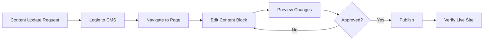

# UAdeC Exchange Department - Homepage Content Map

## 🗺️ Visual Layout Guide

```
┌─────────────────────────────────────────────────────────────┐
│                    NAVIGATION BAR                            │
│  UAdeC Intercambio | Inicio | Programas | Noticias |       │
│                     FAQ | Contacto | Login/SEIM              │
└─────────────────────────────────────────────────────────────┘

┌─────────────────────────────────────────────────────────────┐
│                    HERO SECTION (Top)                        │
│  ┌────────────────────────────────────────────────────┐     │
│  │ "Bienvenido a la Dirección de Intercambio         │     │
│  │  Académico"                                        │     │
│  │                                                     │     │
│  │ Universidad Autónoma de Coahuila - Transformando  │     │
│  │ vidas a través de experiencias internacionales    │     │
│  │                                                     │     │
│  │        [ Explorar Programas Button ]               │     │
│  └────────────────────────────────────────────────────┘     │
└─────────────────────────────────────────────────────────────┘

┌─────────────────────────────────────────────────────────────┐
│              BLOCK 1: Secondary Hero Banner                  │
│  ┌────────────────────────────────────────────────────┐     │
│  │ 🌍 "Vive una Experiencia Internacional"           │     │
│  │                                                     │     │
│  │ Amplía tus horizontes académicos y culturales     │     │
│  │ con nuestros programas de intercambio             │     │
│  │                                                     │     │
│  │        [ Ver Programas Button ]                    │     │
│  └────────────────────────────────────────────────────┘     │
└─────────────────────────────────────────────────────────────┘

┌─────────────────────────────────────────────────────────────┐
│           BLOCK 2: Feature Cards Grid (3 columns)            │
│  "¿Por qué elegir un intercambio académico?"                │
│                                                               │
│  ┌──────────┐  ┌──────────┐  ┌──────────┐                  │
│  │ 🌐 Exp.  │  │ 🎓 Créd. │  │ 👥 Apoyo │                  │
│  │ Internat.│  │ Revalid. │  │ Integral │                  │
│  └──────────┘  └──────────┘  └──────────┘                  │
│                                                               │
│  ┌──────────┐  ┌──────────┐  ┌──────────┐                  │
│  │ 💰 Becas │  │ 🗣️ Idiomas│  │ 💼 Ventaja│                  │
│  │ Disponib.│  │ Desarr.  │  │ Competit.│                  │
│  └──────────┘  └──────────┘  └──────────┘                  │
└─────────────────────────────────────────────────────────────┘

┌─────────────────────────────────────────────────────────────┐
│              BLOCK 3: Call-to-Action (Green)                 │
│  ┌────────────────────────────────────────────────────┐     │
│  │ 📢 ¡Convocatoria Abierta para Primavera 2026!     │     │
│  │                                                     │     │
│  │ Las aplicaciones están abiertas hasta el          │     │
│  │ 15 de enero de 2026                                │     │
│  │                                                     │     │
│  │        [ Ver Convocatoria Button ]                 │     │
│  └────────────────────────────────────────────────────┘     │
└─────────────────────────────────────────────────────────────┘

┌─────────────────────────────────────────────────────────────┐
│           BLOCK 4: Process Steps (6 steps)                   │
│  "¿Cómo aplicar?"                                            │
│                                                               │
│  ① Infórmate → ② Prepara Docs → ③ Aplica en Línea         │
│  ④ Evaluación → ⑤ Preparativos → ⑥ ¡Viaja!                 │
│                                                               │
│  Each step includes icon, title, and description            │
└─────────────────────────────────────────────────────────────┘

┌─────────────────────────────────────────────────────────────┐
│              BLOCK 5: Student Testimonial                    │
│  ┌────────────────────────────────────────────────────┐     │
│  │ "Mi experiencia en la Universidad de Salamanca    │     │
│  │  cambió mi vida. No solo mejoré mi nivel          │     │
│  │  académico, sino que hice amigos de todo el       │     │
│  │  mundo..."                                         │     │
│  │                                                     │     │
│  │  — María Rodríguez                                │     │
│  │    Estudiante de Relaciones Internacionales       │     │
│  └────────────────────────────────────────────────────┘     │
└─────────────────────────────────────────────────────────────┘

┌─────────────────────────────────────────────────────────────┐
│              BLOCK 6: FAQ Section (Accordion)                │
│  "Preguntas Frecuentes"                                      │
│                                                               │
│  ▼ ¿Cuál es el promedio mínimo requerido?                   │
│  ▶ ¿Necesito saber el idioma del país?                      │
│  ▶ ¿Cuánto tiempo dura un intercambio?                      │
│  ▶ ¿Puedo elegir mis materias en el extranjero?            │
└─────────────────────────────────────────────────────────────┘

┌─────────────────────────────────────────────────────────────┐
│         BLOCK 7: Final Call-to-Action (Blue)                 │
│  ┌────────────────────────────────────────────────────┐     │
│  │ ¿Listo para tu aventura internacional?            │     │
│  │                                                     │     │
│  │ Contáctanos para más información o agenda una     │     │
│  │ cita con nuestros asesores                        │     │
│  │                                                     │     │
│  │        [ Contactar Ahora Button ]                  │     │
│  └────────────────────────────────────────────────────┘     │
└─────────────────────────────────────────────────────────────┘

┌─────────────────────────────────────────────────────────────┐
│                         FOOTER                               │
│  © 2024 SEIM - Student Exchange Information Management      │
└─────────────────────────────────────────────────────────────┘
```

---

## 📊 Content Breakdown

### Target Audience Mapping

#### **For Students** 🎓
| Section | Purpose | Action |
|---------|---------|--------|
| Hero Section | Immediate welcome & orientation | Browse programs |
| Feature Cards | Understand benefits | Learn more |
| CTA: Convocatoria | Urgency for applications | Apply now |
| Process Steps | Clear application guide | Follow steps |
| Testimonial | Social proof & motivation | Connect emotionally |
| FAQ Section | Quick answers | Reduce barriers |
| Final CTA | Convert to contact | Schedule appointment |

#### **For Teachers/Faculty** 👨‍🏫
| Section | Purpose | Value |
|---------|---------|-------|
| Hero Section | Department overview | Understand mission |
| Feature Cards | Program benefits to share | Advise students |
| Process Steps | Guide student applications | Mentor effectively |
| Contact | Direct communication | Coordinate |

#### **For Parents/Guardians** 👪
| Section | Purpose | Value |
|---------|---------|-------|
| Feature Cards | Safety & support assurance | Peace of mind |
| FAQ Section | Address concerns | Trust building |
| Contact | Direct communication | Ask questions |

---

## 🎨 Color Scheme

- **Primary**: Blue (#0d6efd) - Navigation, main CTAs
- **Success**: Green (#198754) - Convocatoria urgency
- **Light**: White/Light gray backgrounds - Content sections
- **Dark**: Dark gray/black - Footer, text

---

## 🔤 Typography Hierarchy

- **Display 4**: Hero title (largest)
- **Lead**: Hero subtitle
- **H2**: Section headings
- **H5**: Card titles
- **Body**: Regular content text

---

## 📱 Mobile Responsiveness

All sections adapt to mobile:
- **Hero**: Single column, smaller text
- **Feature Cards**: Stack vertically (1 column)
- **Process Steps**: Vertical timeline
- **Navigation**: Hamburger menu

---

## 🎯 Conversion Funnel

```
Landing Page Visit
      ↓
View Hero & Benefits (awareness)
      ↓
Read Process Steps (consideration)
      ↓
See Testimonial (social proof)
      ↓
Check FAQ (objection handling)
      ↓
Click CTA → Contact/Apply (conversion)
```

---

## ⚡ Quick Edit Checklist

### Regular Updates Needed
- [ ] Update convocatoria dates and deadlines
- [ ] Add new blog posts (student experiences, news)
- [ ] Update available program spots
- [ ] Refresh testimonials seasonally
- [ ] Add new FAQ items based on common questions
- [ ] Update contact information if changed

### Seasonal Updates
- [ ] Change call-to-action for current semester
- [ ] Update program availability
- [ ] Add seasonal imagery (if desired)
- [ ] Refresh statistics (number of exchanges, countries)

### Content Quality Checks
- [ ] Verify all links work
- [ ] Check spelling/grammar
- [ ] Test on mobile devices
- [ ] Verify images load properly
- [ ] Test form submissions
- [ ] Review SEO metadata

---

## 📈 Performance Metrics to Track

Monitor these through analytics:
- **Page views**: Total visits to homepage
- **Bounce rate**: % leaving without interaction
- **CTA clicks**: Conversions on buttons
- **Time on page**: Engagement indicator
- **Mobile vs Desktop**: Device usage patterns
- **Most viewed sections**: Heat mapping

---

## 🚀 Enhancement Opportunities

### Quick Wins
1. Add real photos from UAdeC campus
2. Include video testimonials
3. Add live chat widget
4. Create program comparison table
5. Add countdown timer to application deadlines

### Medium Effort
1. Interactive map of partner universities
2. Photo gallery from past exchanges
3. Success stories carousel
4. Newsletter signup form
5. Event calendar integration

### Long Term
1. AI chatbot for instant answers
2. Virtual campus tours
3. Live webinar scheduling
4. Alumni network section
5. Scholarship calculator tool

---

## 📝 Content Update Workflow



---

**Last Updated**: November 20, 2025
**Next Review**: Monthly
**Content Owner**: UAdeC Exchange Department

