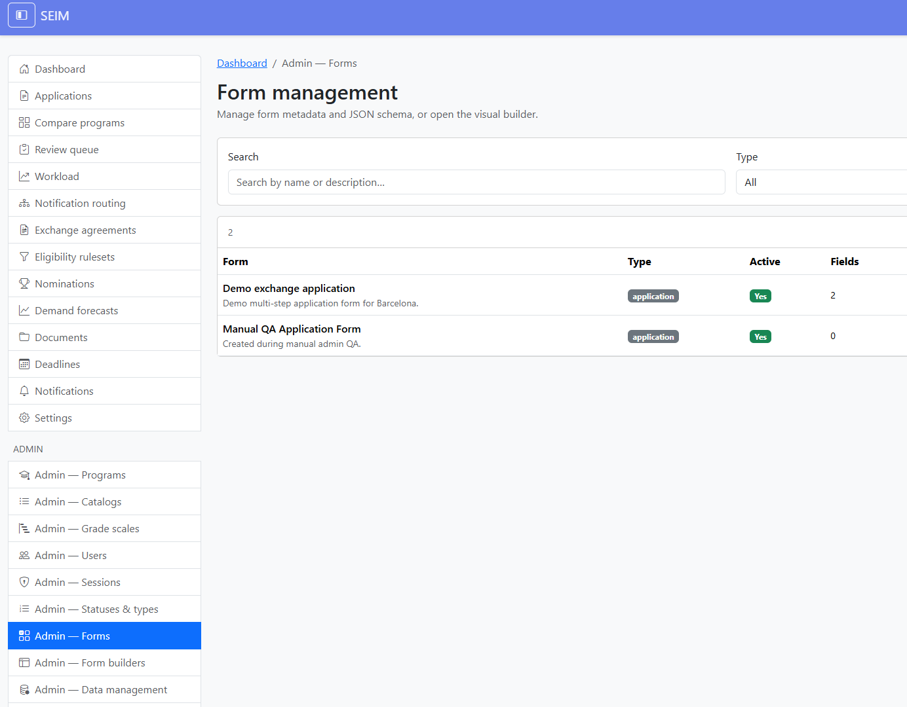
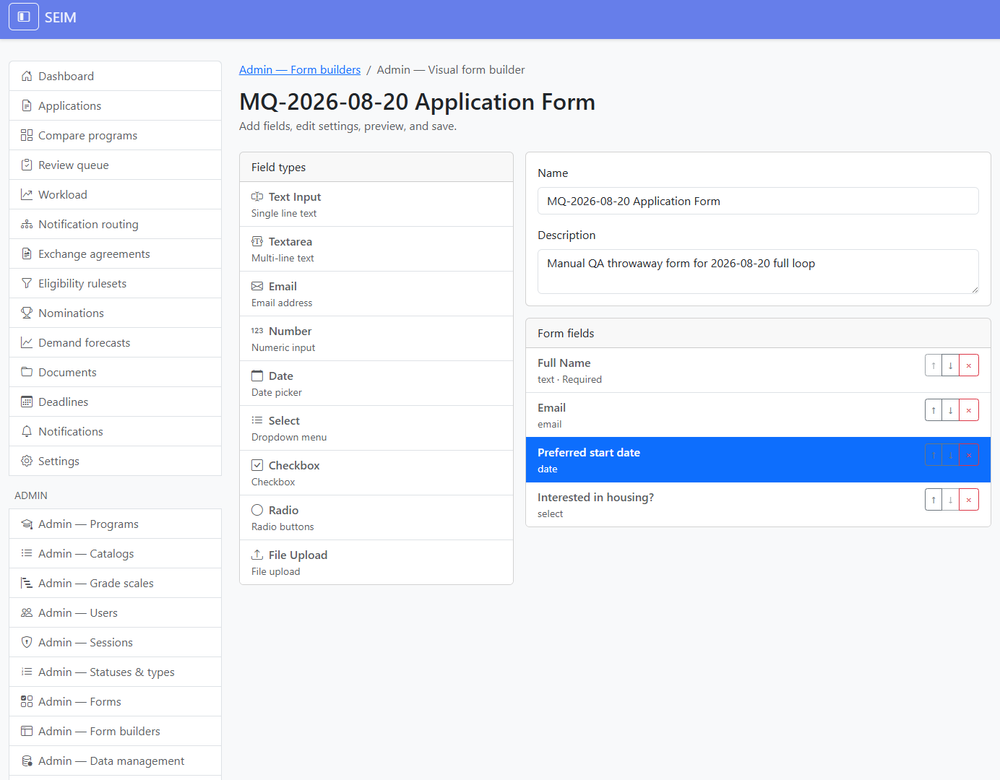
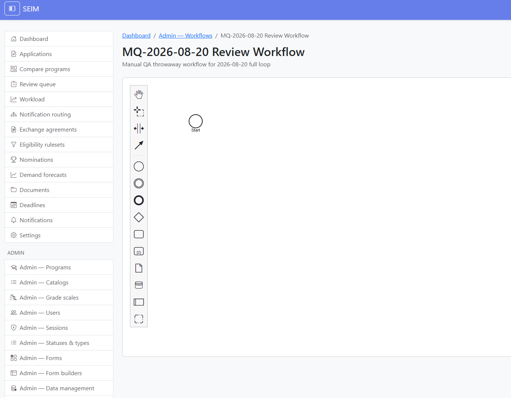
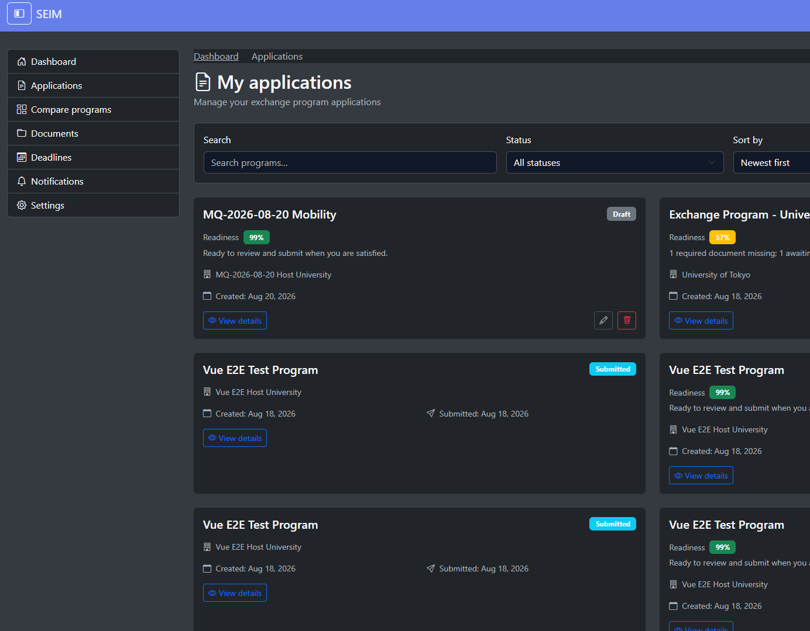

# Manual QA — 2026-08-20 (admin forms, form builder, workflows)

**Stack:** Compose `seim-localprod` @ `http://localhost:8020`  
**Accounts:** Admin `admin@test.com` / `admin123`; Student `student@test.com` / `student123`  
**Prefix:** All throwaway objects `MQ-2026-08-20*` (left in DB for audit)

## Summary

| Step | Result |
|------|--------|
| Env / SPA | **Pass** — `/seim/login` shows Vue 3.5.41 (not missing-dist); `/health/` OK |
| Forms catalog | **Pass** — list, filters; seed row opened read-only (JSON modal, no save) |
| Form builder | **Pass** — created form, 4 fields, preview, save, reload persist |
| Workflows | **Pass** — created, validated, published v1 (UI Validate blocked by overlay; API used) |
| Program attach | **Pass** — program + form + workflow + host destination |
| Student apply | **Pass** — dynamic form visible; draft saved |
| Role gate | **Pass** — student cold `/seim/admin/forms` → `/seim/applications` |
| Workflow instance | **Pass** — created on draft save (`running`, version `ce5f679c-…`) |

**Overall: Pass** (no defects filed)

## Throwaway artifacts

| Object | ID / URL |
|--------|----------|
| Form | **MQ-2026-08-20 Application Form** — form type **3**, `/seim/admin/dynforms/3` |
| Workflow | **MQ-2026-08-20 Review Workflow** — def `69381e40-8f24-4634-97f3-4d28552488d1`, version `ce5f679c-d396-46ef-9958-7676fbb6e210` |
| Program | **MQ-2026-08-20 Mobility** — `0253c69d-30c8-486b-8911-4b5917cba42e` |
| Host university | **MQ-2026-08-20 Host University** — `e4da0ba0-67f4-4f95-83fd-2e5af19a6c12` (Spain) |
| Application (draft) | `b8803663-5f87-45b2-b8e1-3884462a317b` — `/seim/applications/b8803663-5f87-45b2-b8e1-3884462a317b` |
| Workflow instance | `ac9c7012-7ca1-482a-a479-2fb00cae1bee` — status `running`, workflow_version `ce5f679c-…` |

## 1. Environment — Pass

- Login page: real SPA (`SEIM · 2.0.0-vue · Vue 3.5.41`).
- Health endpoint returns 200.

## 2. Forms catalog (`/seim/admin/forms`) — Pass

- List loads with search, type filter, sort.
- **New form** chrome present (creation deferred to Form builders per plan).
- Opened seed **Demo exchange application** read-only via JSON schema modal; closed without save.

## 3. Form builder (`/seim/admin/dynforms`) — Pass

- Created **MQ-2026-08-20 Application Form** (type Application) → editor `/seim/admin/dynforms/3`.
- Fields added (click-to-add palette): **Full Name** (required), **Email**, **Interested in housing?** (select Yes\|yes / No\|no), **Preferred start date**.
- Preview matched canvas; **Save** succeeded; reload showed persisted fields.
- Forms catalog row shows field count > 0.

**Observation (non-blocking):** Label edits on select/date fields were finicky when switching fields quickly; final saved state OK.

## 4. Workflows (`/seim/admin/workflows`) — Pass

- Created **MQ-2026-08-20 Review Workflow**; editor shows canvas + properties + **v1 — Draft**.
- **Validate** in UI: click intercepted by toast/overlay (same class as prior QA).
- **Validate + Publish** via API (`POST …/validate/` → `valid: true`; publish → status `published`).
- List shows latest published **v1**; reload editor shows **v1 — Published**.
- BPMN: default Start event only (sufficient for validate/publish).

## 5. Program + destinations — Pass

- Program **MQ-2026-08-20 Mobility**: active; window 2026-08-20 → 2026-12-31; dates 2027-01-15 → 2027-06-30.
- Attached form id **3** + published workflow version `ce5f679c-…`.
- Host destination **MQ-2026-08-20 Host University** + country **Spain** saved on `/seim/admin/programs/0253c69d-…/destinations`.
- API: `application_form: 3`, `workflow_version: ce5f679c-…`, `application_window_open: true`.

## 6. Student loop — Pass

- Logout admin → login student → `/seim/applications/new`.
- Selected **MQ-2026-08-20 Mobility**; **Program questions** section rendered builder fields:
  - Full Name *, Email, Interested in housing?, Preferred start date
- Host university **MQ-2026-08-20 Host University** selected (school/program dropdowns disabled — no schools under host; draft save still allowed).
- Filled required + optional fields; **Save as draft** → redirect to application detail.
- Status **Draft**; timeline: *Dynamic form 'MQ-2026-08-20 Application Form' submitted.*
- List shows new draft at top (**99%** ready).

**API verify:** `dynamic_form_submission.responses` contains all four field values; `readiness.form_complete: true`.

## 7. Role gate — Pass

- Student cold-open `/seim/admin/forms` → redirected to `/seim/applications` (no catalog).

## 8. Workflow instance (optional) — Pass

- Django shell: `WorkflowInstance` for application `b8803663-…` exists — id `ac9c7012-…`, status `running`, `workflow_version_id` = published throwaway version.

## Observations (not filed)

- Workflow editor **Validate** button blocked by overlay; API equivalent works.
- Form builder label focus when switching fields quickly.
- Destinations country field is autocomplete; Spain accepted on save.

## Follow-up fixes (same day)

Addressed in code (see repo):

1. **Toast overlay** — `ToastContainer` uses `pointer-events: none` on the container / `auto` on toasts so header actions (Validate) stay clickable.
2. **BPMN overlay** — workflow editor contains the canvas (`overflow: hidden` + header `z-index`) so bpmn-js overlays cannot cover Validate/Save/Publish.
3. **Form builder** — canvas rows no longer nest buttons inside buttons; field settings remount on selection (`:key`) and focus the label input.
4. **Country select** — English aliases (e.g. `Spain` → `España`) + blur/Enter resolve; save requires a selected country. Throwaway host `e4da0ba0-…` backfilled to `España`.
