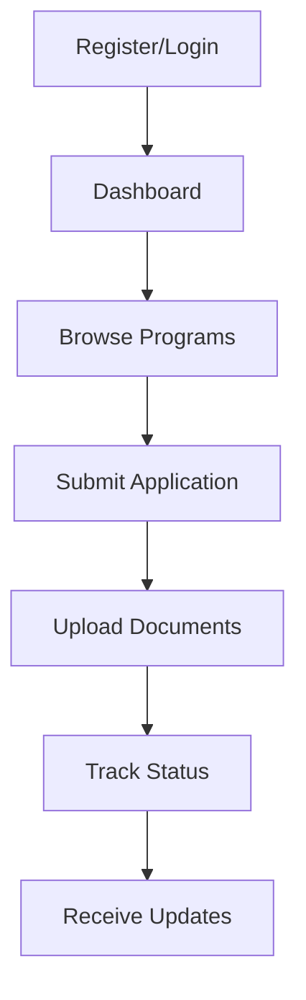
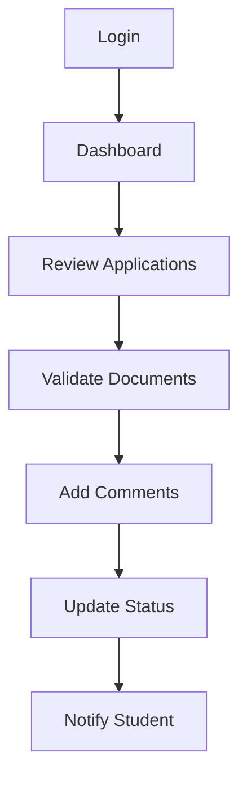
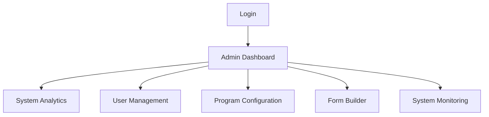

# SEIM Wireframes

This directory contains UI/UX wireframes for the SEIM application, providing visual reference for key user interfaces and workflows.

---

## 📱 User Interface Overview

SEIM features role-based dashboards and interfaces designed for three primary user types:

### **Student Interface**
- Program browsing and application submission
- Document upload and management
- Application status tracking
- Communication with coordinators

### **Coordinator Interface**
- Application review and processing
- Document validation and comments
- Program management (draft mode)
- Student communication

### **Admin Interface**
- System analytics and reporting
- User management
- Program configuration
- Form builder and customization

---

## 🎨 Wireframe Categories

### **Authentication & User Management**
- [Login Interface](wireframes_authentication.md) - User authentication and registration
- [User Profile](wireframes_authentication.md) - Profile management and settings

### **Core Application Workflows**
- [Dashboard](wireframes_dashboard.md) - Role-based dashboard interfaces
- [Program Management](wireframes_program_management.md) - Program creation and management
- [Application Detail](wireframes_application_detail.md) - Application review and processing

### **Document & File Management**
- [Document Upload](wireframes_document_upload.md) - File upload and validation interface
- [Document Management](wireframes_document_upload.md) - Document organization and review

### **Administrative Features**
- [Analytics Dashboard](wireframes_analytics.md) - System metrics and reporting
- [Form Builder](wireframes_form_builder.md) - Dynamic form creation interface

---

## 🔄 User Workflows

### **Student Workflow**

### **Coordinator Workflow**

### **Admin Workflow**

---

## 🎯 Design Principles

### **User Experience**
- **Role-based Design**: Tailored interfaces for each user type
- **Progressive Disclosure**: Information revealed as needed
- **Consistent Navigation**: Unified navigation patterns
- **Responsive Design**: Mobile-first approach

### **Visual Design**
- **Clean Interface**: Minimal, focused design
- **Clear Hierarchy**: Logical information organization
- **Accessibility**: WCAG compliance considerations
- **Modern Aesthetics**: Bootstrap 5 design system

### **Interaction Design**
- **Intuitive Workflows**: Logical user journeys
- **Feedback Systems**: Clear status and progress indicators
- **Error Handling**: Helpful error messages and recovery
- **Loading States**: Appropriate loading indicators

---

## 📋 Implementation Status

| Wireframe | Status | Implementation |
|-----------|--------|----------------|
| **Authentication** | ✅ Complete | Bootstrap 5 forms with JWT |
| **Dashboard** | ✅ Complete | Role-based dashboards |
| **Program Management** | ✅ Complete | CRUD interfaces |
| **Application Detail** | ✅ Complete | Workflow management |
| **Document Upload** | ✅ Complete | File upload with validation |
| **Analytics** | ✅ Complete | Charts and metrics |
| **Form Builder** | ✅ Complete | Dynamic form creation |

---

## 🔧 Technical Implementation

### **Frontend Framework**
- **Bootstrap 5**: CSS framework for responsive design
- **Django Templates**: Server-side rendering
- **JavaScript**: Client-side interactions
- **SweetAlert2**: Modern notifications

### **Key Components**
- **Navigation**: Bootstrap navbar with role-based menus
- **Forms**: Bootstrap form components with validation
- **Tables**: Responsive data tables with sorting/filtering
- **Cards**: Information display and organization
- **Modals**: Overlay dialogs for actions
- **Alerts**: Status messages and notifications

### **Responsive Design**
- **Mobile-first**: Optimized for mobile devices
- **Breakpoints**: Bootstrap 5 responsive breakpoints
- **Touch-friendly**: Appropriate touch targets
- **Progressive enhancement**: Core functionality works without JavaScript

---

## 📚 Related Documentation

- **[Developer Guide](../developer_guide.md)** - Frontend development guidelines
- **[Architecture](../architecture.md)** - System architecture overview
- **[Business Rules](../business_rules.md)** - Business logic and workflows
- **[API Documentation](http://localhost:8000/api/docs/)** - Backend API reference

---

**Note**: These wireframes serve as design reference and have been implemented in the current application. For the latest interface designs, refer to the live application. 