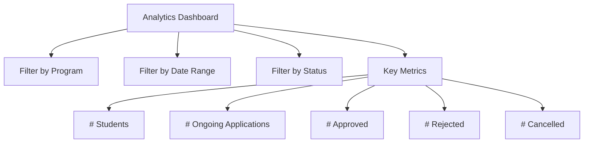
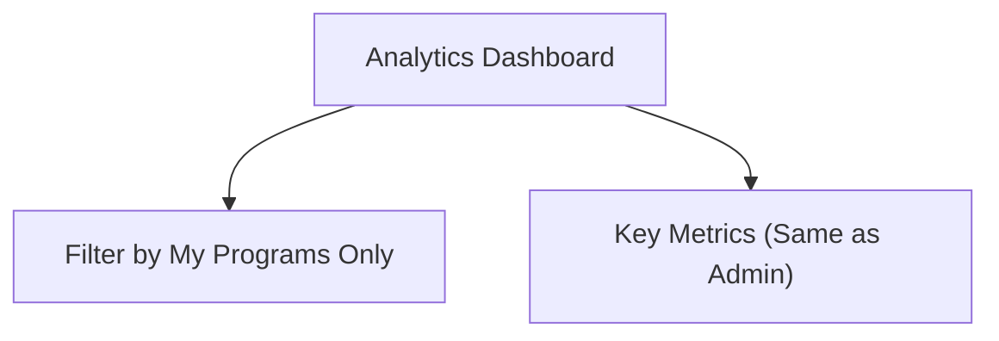

# SEIM Analytics Dashboard Wireframe

---

## Admin Analytics Dashboard

---

## Coordinator Analytics Dashboard

---

This wireframe shows the analytics dashboard for admins and coordinators, with role-based filtering. 