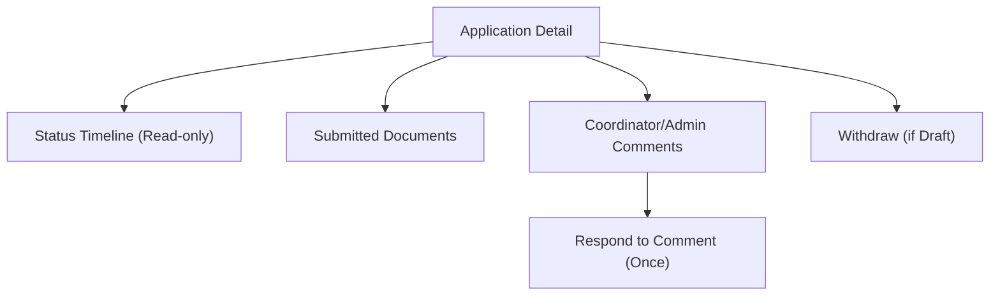
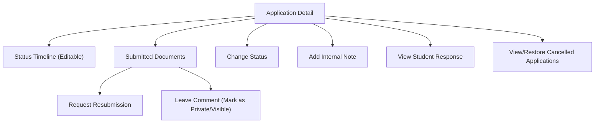

# SEIM Application Detail Wireframe

---

## Student View

---

## Coordinator/Admin View

---

This wireframe outlines the main elements and actions for the application detail view for each role. 