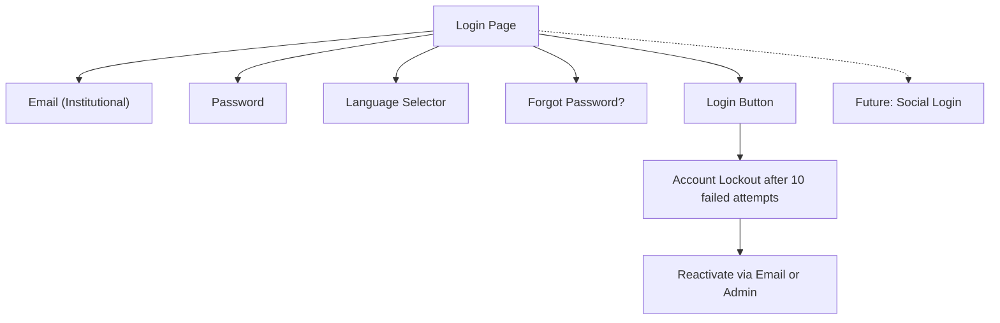
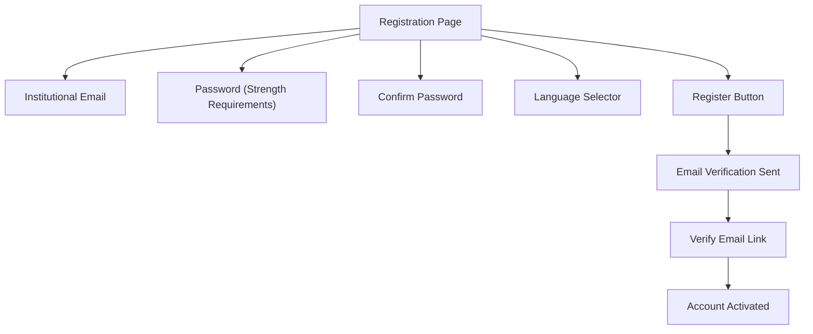
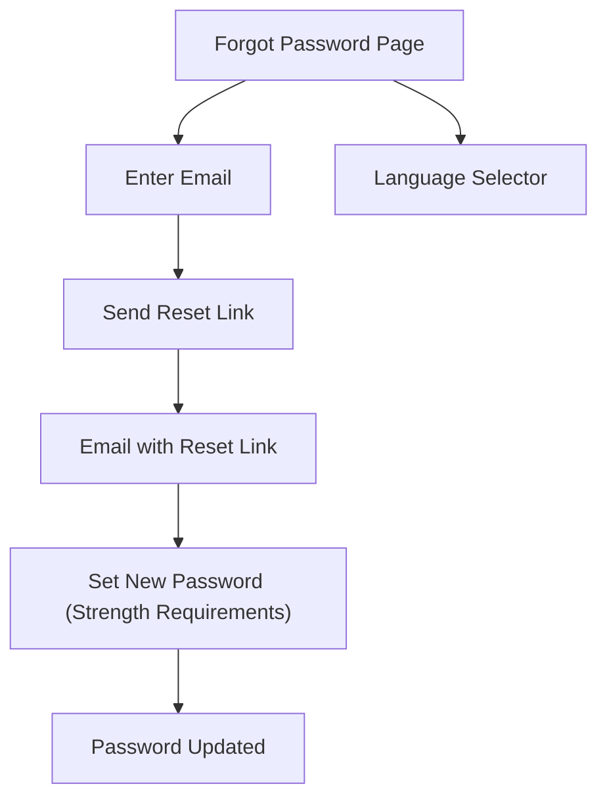
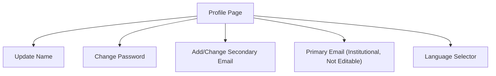
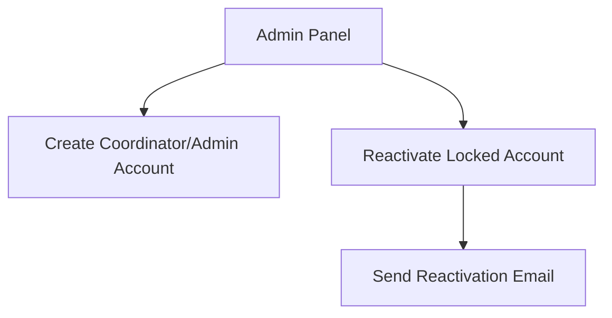

# SEIM Authentication Wireframes

---

## Login Flow

---

## Registration Flow (Student)

---

## Password Reset Flow

---

## Profile Update Flow

---

## Admin Account Management

---

> Future plans: Social login and MFA may be added in later versions.

All authentication screens support language selection from the start. 