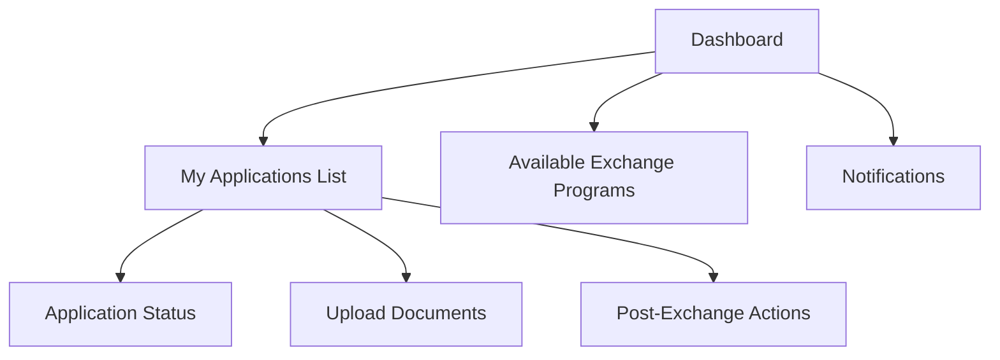
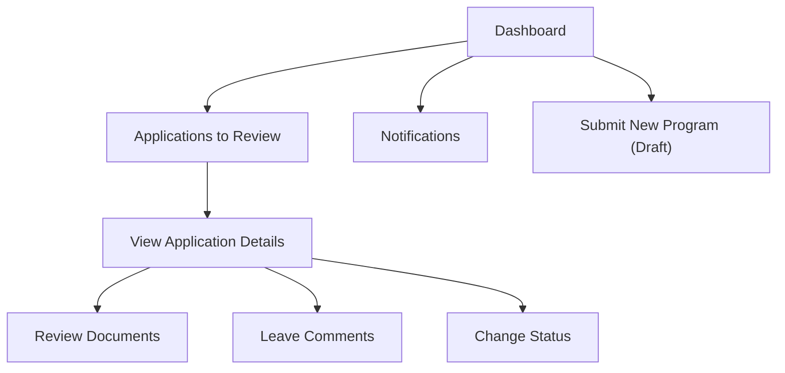
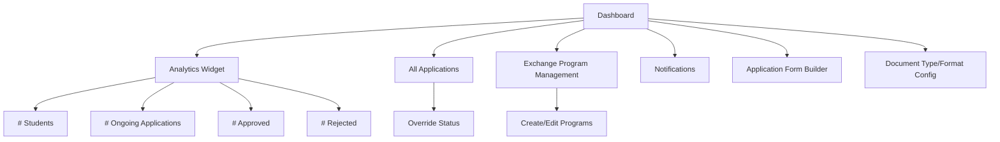

# SEIM Dashboard Wireframes

Below are simple wireframes for the main dashboard, tailored to each user role.

---

## Student Dashboard

---

## Coordinator Dashboard

---

## Admin Dashboard

---

These wireframes provide a high-level overview of the dashboard experience for each role. 