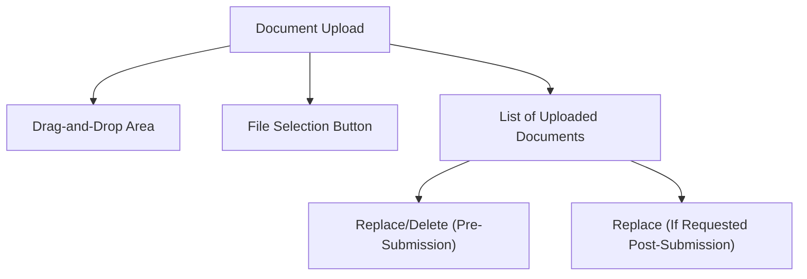
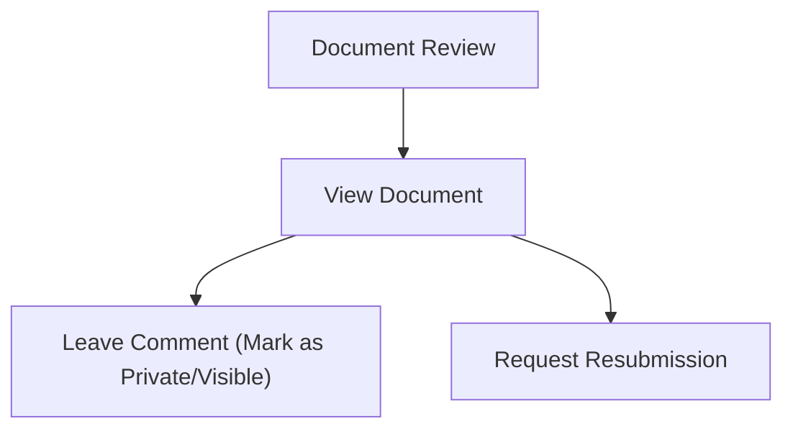

# SEIM Document Upload & Review Wireframe

---

## Student Document Upload

---

## Coordinator/Admin Document Review

---

This wireframe shows the document upload and review process for students and coordinators/admins. 