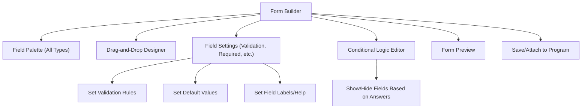

# SEIM Dynamic Form Builder Wireframe

---

## Admin Form Builder (django-dynforms)

---

> Powered by [django-dynforms](https://github.com/michel4j/django-dynforms)

This wireframe shows the main features of the dynamic form builder for admins. 