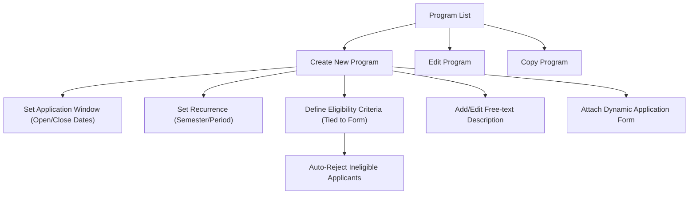

# SEIM Program Management Wireframe

---

## Admin/Coordinator Program Management

```mermaid
flowchart TD
    A["Program List"] --> B["Create New Program"]
    A --> C["Edit Program"]
    A --> D["Copy Program"]
    B --> E["Set Application Window (Open/Close Dates)"]
    B --> F["Set Recurrence (Semester/Period)"]
    B --> G["Define Eligibility Criteria (Tied to Form)"]
    B --> H["Add/Edit Free-text Description"]
    B --> I["Attach Dynamic Application Form"]
    G --> J["Auto-Reject Ineligible Applicants"]
```

---

This wireframe outlines the main elements for managing exchange programs. 